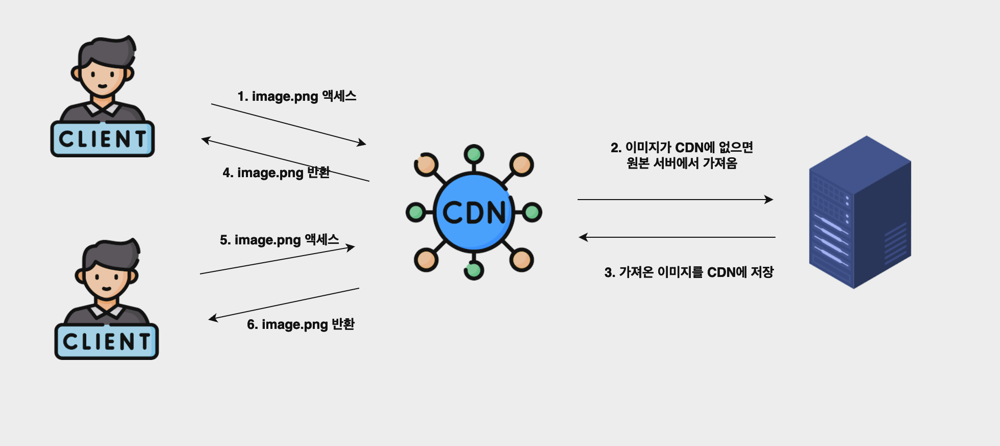

# 1장 사용자 수에 따른 규모 확장성

### 단일 서버

모든 컴포넌트가 단 한 대의 서버에서 실행되는 간단한 시스템

### 데이터베이스

사용자가 늘면 서버 하나로는 충분치 않아서 여러 서버를 두어야 한다

하나는 웹/모바일 트래픽 처리 용도고 하나는 데이터베이스용이다 (그림)

웹/모바일 트래픽 처리 서버(웹 계층)와 데이터베이스 서버(데이터 계층)를 분리하면 각각 독립적으로 확장해 나갈 수 있게 된다

`어떤 데이터베이스를 사용핧 것인가`
- 관계형 데이터베이스
  - 자료를 테이블과 열,칼럼으로 표현
  - SQL을 사용하면 여러 테이블에 있는 데이터를 관계에 따라 조인하여 합칠 수 있다
- 비 관계형 데이터베이스 
  - 키-값 저장소, 그래프저장소, 칼럼저장소, 문서 저장소 네 부류로 나눌 수 있다
  - 일반적으로 조인 연산 지원하지 않는다

다음과 같은 경우에 비관계형 데이터베이스가 바람직한 선택일 수 있다
- 아주 낮은 응답 지연시간(latency)이 요구됨
- 다루는 데이터가 비정형(unstructured)라 관계형 데이터가 아님
- 데이터(JSON,YAML,XML 등)를 직렬화하거나 역질렬화 할 수 있기만 하면 됨
- 아주 많은 양의데이터를 저장할 필요가 있음

### 수직적 규모 확장, 수평적 규모 확장

서버로 유입되는 트래픽의 양이 적을 때는 수직적 확장이 좋은 선택이다.

이 방법의 큰 장점은 단순하지만 다음의 단점이 있다
- 수직적 규모 확장에는 한계가 있다. 한대의 서버에 CPU나 메모리를 무한대로 증설할 방법은 없다
- 수직적 규모 확장법은 장애에 대한 복구(fail over)방안이나 다중화(re-dundancy)방안을 제시하지 않는다
    
    서버에 장애가 발생하면 웹사이트/앱은 완전히 중단된다

이런 단점 때문에 대규모 애플리케이션을 지원하는 데는 수평적 규모 확장법이 적절하다

`로드 밸런서`

로드 밸런서는 부하 분산 집합(load balancing set)에 속한 웹서버들에게 트래픽 부하를 고르게 분산하는 역할을 한다

사용자는 공개 IP 주소(public IP address)로 접속

따라서 웹 서버는 클라이언트의 접속을 직접 처리하지 않고 더 나은 보안을 위해 서버 간 통신에는 사설 IP주소가 이용된다

로드밸런서는 웹 서버와 통신하기 위해 바로 이 사설주소를 이용한다

부하 분산 집합에 또 하나의 웹서버를 추가하고 나면 장애를 자동 복구하지 못하는 문제는 해소되며

웹 계층의 가용성은 향상된다.

`데이터베이스 다중화`

데이터베이스 다중화는 보통 서버 사이에 주(master)-부(salve)관계를 설정하고 데이터 원본은 주 서버에, 사본은 부 서버에 저장하는 방식이다

데이터베이스를 다중화하면 다음과 같은 이득이 있다
- 더 나은 성능:모든 데이터 변경 연산은 주 데이터베이스 서버로만 전될되는 반면 읽기 연산은 부 데이터베이스 서버들로 분산됨 
- 안정성: 데이터베이스 서버 가운데 일부가 파괴되어도 데이터는 보존된다. 지역적으로 떨어진 여러 장소에 다중화시켜 놓을 수 있기에
- 가용성: 하나이 데이터 베이스 서버에 장애가 발생해도 다른 서버에 있는 데이터를 가져와 서비스

### 캐시

캐시는 값비싼 연산 결과 또는 자주 참조되는 데이터를 메모리 안에 두고, 뒤이은 요청이 보다 빨리 처리될 수 있도록 하는 저장소

애플리케이션 성능은 데이터베이스를 얼마나 자주 호출하느냐에 크게 좌우되는데, 캐시는 그런 문제를 완화할 수 있다

`캐시 계층`

캐시 계층은 데이터가 잠시 보관되는 곳으로 데이터베이스보다 훨씬 빠르다. 별도의 캐시 계층을 두면 성능이 개선될 뿐 아니라

데이터베이스의 부하를 줄일 수 있고, 캐시 계층의 규모를 독립적으로 확장시키는 것도 가능해진다

`캐시 사용시 유의할 점`
- 캐시는 어떤 상황에 바람직한가? 
  - 데이터 갱신은 자주 일어나지 않지만 참조가 빈번하다면 고려
- 어떤 데이터를 캐시에 둘까?
  - 휘발성 메모리이므로 영속적으로 보관할 데이터를 캐시에 두는건 바람직하지 않다
- 캐시에 보관된 데이터는 어떻게 만료되는가?
  - 만료된 데이터는 캐시에서 삭제되어야 한다. 만료 정책이 없으면 캐시에 계속 남게 된다
- 일관성은 어떻게 유지되는가?
  - 저장소의 원본을 갱신하는 연산과 캐시 갱신 연산이 단일 트랜잭션으로 처리되지 않는경우 일관성은 깨질 수 있다
- 장애에는 어떻게 대처할 것인가?
  - 캐시 서버를 한 대만 두는 경우 해당 서버는 SPOF이 되어버릴 가능성이 있다
  - 캐시 서버를 여러 지역에 걸쳐 분산시켜야 한다
- 캐시 메모리는 얼마나 크게 잡을 것인가?
  - 캐시 메모리가 너무 작으면 액세스 패턴에 따라 데이터가 너무 자주 캐시에서 밀려나버려 캐시 성능이 떨어진다
- 데이터 방출 정책은 무엇인가?
  - LRU, LFU가 있으며 선택에 맞게 적용할 수 있다

### 콘텐츠 전송 네트워크(CDN)

CDN은 정적 컨텐츠를 전송하는 데 쓰이는, 지리적으로 분산된 서버의 네트워크이다.

간단하게 말하면 요청경로, 질의 문자열, 쿠키, 요청 헤더 등의 정보에 기반하여 HTML 페이지를 캐시하는 것

`CDN 사용 시 고려해야 할 사항`

- 비용 
  - CDN으로 들어가고 나가는 데이터 전송 양에 따라 요금을 내므로 자주 사용되지 안는 콘텐츠캐싱은 빼는 것을 고려
- 적절한 만료 시한 설정
  - 시의성이 중요한 콘텐츠의 경우 만료 시점을 잘 정해야 한다 (너무 길지도 짧지도 않게)
- CDN 장애에 대한 대처 방안
  - CDN자체가 죽었을 경우 웹사이트/애플리케이션이 어떻게 동작해야 하는지 고려햐야함
- 콘텐츠 무효화 방법
  - 아직 만료되지 않은 콘텐츠라 해도 다음 방법 중 하나를 쓰면 CDN에서 제거할 수 있다
    - CDN서비스 사업자가 제공하는 API를 이용해 콘텐츠 무효화
    - 콘텐츠의 다른 버전을 서비스하도록 오브젝트 버저닝 이용
      - 콘텐츠의 새로운 버전을 지정하기 위해서는 URL마지막에 버전번호를 인자로 주면된다
### 무상태(stateless) 웹 계층

웹 계층을 수평적으로 확장하려면 상태정보를 웹 계층에서 제거해야 한다

바람직한 전략은 상태 정보를 관계형 데이터베이스나 NOSQL같은 지속성 저장소에 보관하고 필요할 때 가져오는 것이다

### 데이터 센터

여러 개의 데이터 센터를 사용하는 경우에는 일반적으로 가장 가까운 데이터 센터로 안내된다

이 절차를 지리작 라우팅이라고 부른다.

또한 데이터 센터에 심각한 장애가 발생하면 모든 트래픽은 장애가 없는 데이터 센터로 전송되어야 한다

다중 데이터 센터 아키텍처를 만들려면 몇가지 기술적 난제를 해결해야 한다
- 트래픽 우회: 올바른 데이터 센터로 트래픽을 보내는 효과적 방법을 찾아야 한다
- 데이터 동기화: 데이터 센터마다 별도의 데이터베이스를 사용하고 있는 상황이라면 장애가 자동 복구되어 트래픽이 다른 데이터베이스로
    
    우회된다 해도, 해당 데이터 센터에는 찾는 데이터가 없을 수 있다
- 테스트와 배포: 여러 데이터 센터를 사용하도록 시스템이 구성된 상황이라면 웹사이트 또는 애플리케이션을 여러 위치에서 테스트해보는 것이 중요하다

### 메시지 큐

메시지 큐는 메시지의 무손실(메시지 큐에 일단 보관된 메시지는 소비자가 꺼낼 때까지 안전히 보관)을 보장하는 비동기 통신을 지원하는 컴포넌트다.

메시지 큪를 이용하면 서비스 또는 서버 간 결합이 느슨해져서, 규모 확장성이 보장되어야 하는 안정적 애플리케이션을 구성하기 좋다

생산자는 소비자 프로세스가 다운되어 있어도 메시지를 발행할 수 있고 소비자는 생산자 서비스가 가용한 상태가 아니더라도

메시지를 수신할 수 있다.

### 데이터베이스의 규모 확장

저장할 데이터가 많아지면 데이터베이스에 대한 부하도 증가한다.

데이터베이스의 규모를 확장하는 데는 두가지 접근법이 있다. 하나는 수직적 규모 확장법이고 하나는 수평적 규모 확장이다

`수직적 확장`

스케일업이라 부르는 이 방법은 기존 서버에 더 많은 또는 고성능의 자원을 증설하는 방법이다

단점으로는
- 데이터베이스 서버 하드웨어에는 한계가 있으므로 무한 증설할 수는 없다
- SPOF로 인한 위험성이 크다
- 비용이 많이 든다. 고성능 서버로 갈수록 가격이 올라가게 된다

`수평적 확장`

데이터베이스 수평적 확장은 샤딩이라고 부르는데 더 많은 서버를 추가함으로써 성능을 향상시킬 수 있도록 한다

샤딩 전략을 구현할 때 고려해야 할 가장 중요한 것은 샤딩키를 어떻게 정하느냐 하는 것이다

샤딩 키는 파티션키라고도 부르는데 데이터가 어떻게 분산될지 정하는 하나 이상의 칼럼으로 구성된다

샤딩 할때는 다음을 고려해서 해결해야 한다

- 데이터의 재 샤딩
  - 데이터가 너무 많아져서 하나의 샤드로는 더이상 감당하기 어려울 때
  - 샤드간 데이터 분포가 균등하지 못하여 어떤 샤드에 할당된 공간 소모가 다른 샤드에 비해 빨리 진행될 때
- 유명인사 문제
  - 핫스팟 키 문제라고도 부르는데 특정 샤드에 질의가 집중되어 서버에 과부하가 걸리는 문제다
- 조인과 비정규화
  - 하나의 데이터베이스를 여러 샤드 서버로 쪼개고 나면 여러 샤드에 걸친 데이터를 조인하기 힘들어진다
  - 이를 해결하는 한 가지 방법은 데이터베이스를 비정규화하여 하나의 테이블에서 질의가 수행되도록 하는것이다

### 백만 사용자, 그리고 그 이상

시스템 규모를 확장하는 것은 지속적이고 반복적인 과정이다

이번 장을 정리해보면 다음과 같다

- 웹 계층은 무상태 계층으로
- 모든 계층에 다중화 도입
- 가능한 한 많은 데이터를 캐시할 것
- 여러 데이터 센터를 지원할 것
- 정적 컨텐츠는 CDN을 통해 서비스할 것
- 데이터 계층은 샤딩을 통해 그 규모를 확장할 것
- 각 계층은 독립적 서비스로 분할할 것
- 시스템을 지속적으로 모니터링하고, 자동화 도구들을 활용할 것