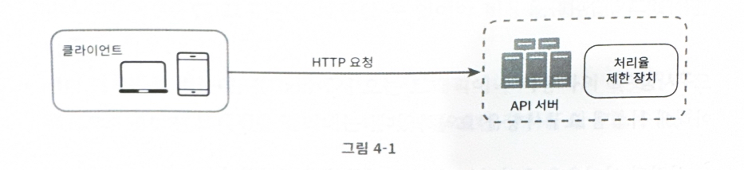
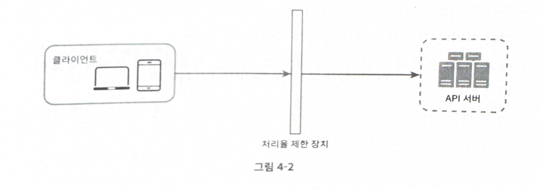
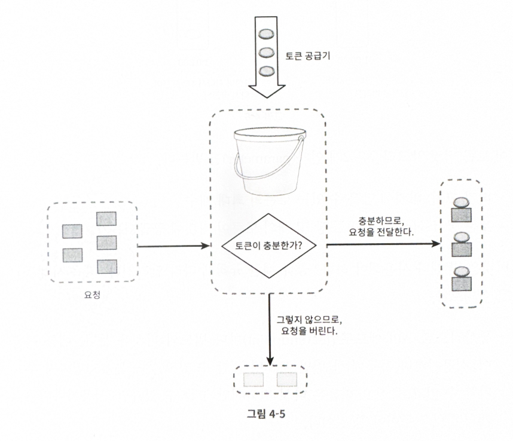
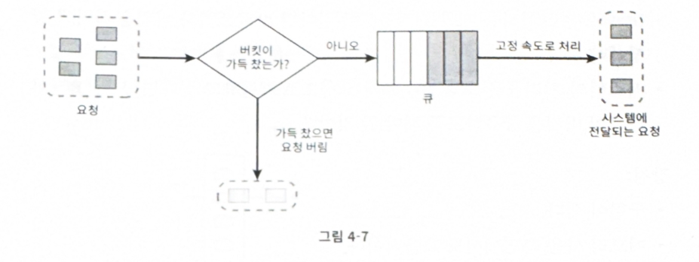
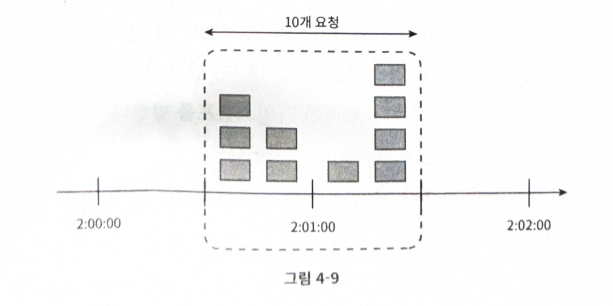
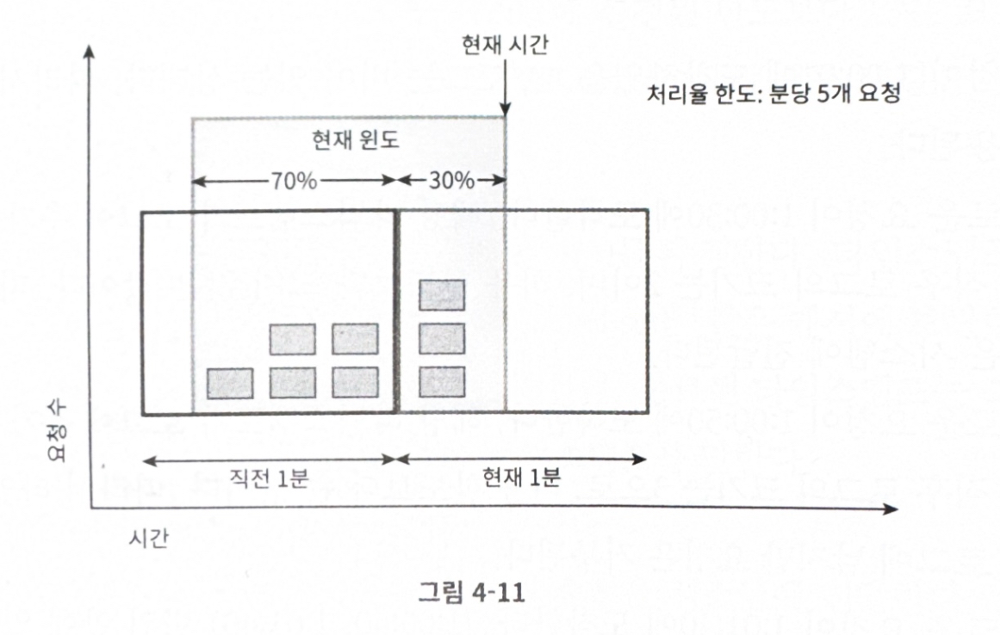
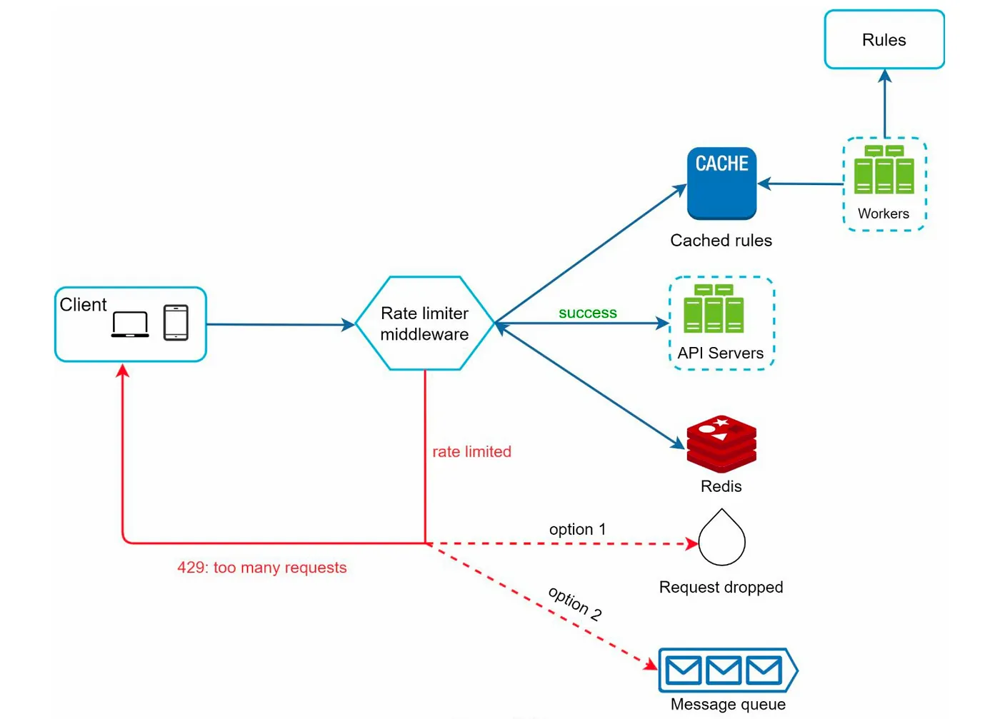
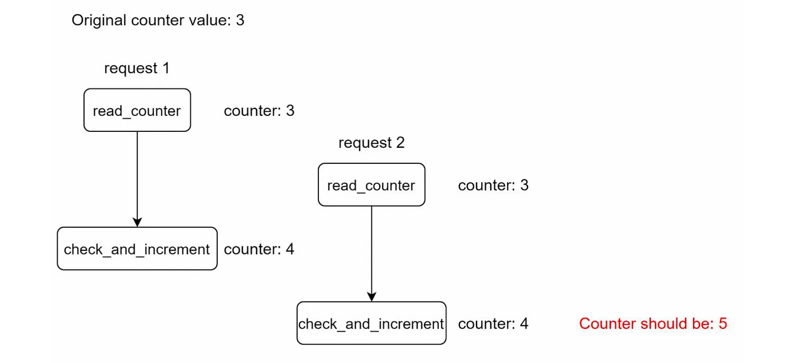

 
 처리율 제한 장치는 클라이언트 또는 서비스가 보내는 트래픽의 처리율을 제어하기 위한 장치

 - DOS공격에 의한 자원 고갈을 방지할 수 있다.
 - 비용을 절감한다. 우선순위가 높은 API에 더많은 자원을 할당할 수 있다
 - 서버 과부하를 막는다. 봇에서 오는 트래픽이나 사용자의 잘못된 이용패턴으로 유발된 트래픽 걸러낼 수 있다

## 1단계 문제 이해 및 설계 범위 확정
- 클라이언트 측 제한 장치인가? 서버 측 제한 장치인가?
- 어떤 기준을 통해 API 호출을 제한하는가? IP주소? 사용자 ID? (기준 설정)
- 시스템 규모는 어떻게 되는가?
- 분산된 환경을 고려해야하는가?
- Rate Limiter가 독립된 서비스로 동작하는가? 어플리케이션 코드에 포함되는가?
- 제한된 경우, 클라이언트에게 알려주어야 하는가?

### 시스템 요구 사항 요약
- 처리율 초과하는 요청은 정확하게 제한
- 낮은 응답시간: 응답시간에 나쁜 영향을 주면 안됨
- 가능한 적은 메모리 사용
- 분산형 처리율 제한: 분산형 구조에서 Rate limiter 또는 현재 상황을 공유할 수 있어야 함
- 예외 처리: 요청이 제한된 경우, 클라이언트가 알 수 있어야 함
- 높은 결함 감내성: 제한 장치에 장애가 생겨도, 전체 시스템에 영향을 주면 안됨

## 2단계 개략적 설계안 제시 및 동의 구하기

### 처리율 제한 장치는 어디에 둘 것인가?

`클라이언트`

- 좋지 않음. 쉽게 위변조가 가능하다. 모든 클라이언트의 구현을 통제하는 것도 어렵다 

`서버`
- 서버 측에 제한 장치 두는 방법

- 미들웨어를 만들어 통제

어디에둘 것인가에 대한 정답은 없으나 고려할 점은 있다

1. 프로그래밍 언어, 캐시 서비스 등 기술 스택 점검 -> 현재 언어가 서버측 구현 지원하기 충분할정도로 효율 높은지
2. 비즈니스에 맞는 처리율 제한 알고리즘을 찾아라. 서드파티 게이트웨이를 쓴다면 선택지는 제한될 수 있다
3. MSA구조에서 이미 API gateway를 설계에 포함시켰다면 처리율 제한 기능 도한 gateway에 포함시켜야 할 수도 있다

### 처리율 제한 알고리즘
- 토큰 버킷
- 누출 버킷
- 고정 윈도 카운터
- 이동 윈도 로그
- 이동 윈도 카운터

#### `1. 토큰 버킷 알고리즘`
- 간단하고 보편적으로 사용되는 알고리즘

`동작원리`

-  토큰 버킷은 지정된 용량을 갖는 컨테이너이고 사전 설정된 양의 토큰이 주기적으로 채워진다
-  꽉 찬 버킷에는 더 이상 토큰이 추가되지 않는다
-  각 요청은 처리될 때마다 하나의 토큰을 사용한다
-  충분한 토큰이 없으면 요청은 버려진다

`토큰 버킷 알고리즘 인자`
- 버킷 크기: 버킷에 담을 수 있는 토큰의 최대 개수
- 토큰 공급률 : 초당 몇 개의 토큰이 버킷에 공급되는가

버킷 사용개수는 통상적으로 api endpoint마다 별도의 버킷을 사용한다

ip 주소별로 처리율 제한을 사용하는 경우 ip주소마다 하나씩 할당해야 한다

시스템 전체에 적용하려는 경우 버킷을 하나 사용하여 적용해야한다

`장점`

- 구현이 쉬움
- 메모리 사용 측면 효율적
- 짧은 시간에 집중되는 트래픽 처리 가능

`단점`

- 버킷 크기의 공급률 조정이 까다로움

#### `2. 누출 버킷 알고리즘`

- 요청 처리율이 고정되어 있음
- 일반적으로 FIFO 큐로 구현

`동작원리`
- 큐에 빈자리가 있으면 요청을 추가
- 큐가 가득 차 있는 경우 요청을 버림
- 지정된 시간마다 큐에서 요청을 꺼내서 처리

`인자값`
- 버킷 크기: 큐 사이즈와 같은 값
- 처리율: 지정된 시간당 몇 개의 항목을 처리할지 지정 

`장점`

- 큐의 크기가 제한되어 있어 메모리 사용량 측면에 효율적
- 고정된 처리율로 안정적 출력이 필요한 경우 적합

`단점`

- 단 시간에 많은 트래픽이 몰리는 경우 요청들을 제때 처리하지 못해 신규 요청이 버려짐
- 인자값을 올바르게 튜닝하기 까다로움

#### `3. 고정 윈도 카운터 알고리즘`

`동작원리`

- 타임라인을 고정된 간격의 윈도로 나누고 윈도마다 카운터를 붙임
- 요청이 접수될 때마다 카운터의 값을 1 증가
- 카운터 값이 설계된 threshold에 도달하면 새로운 요청은 새 윈도가 열릴 때 까지 버려짐

문제점은 트래픽이 집중될 경우 의도한 것과 달리 더 많은 요청을 처리할 수 있음

`장점`

- 메모리 효율이 좋다
- 이해하기 쉽다
- 윈도가 닫히는 시점에 카운터를 초기화하는 방식은 특정한 트래픽 패턴을 처리하기 적합

`단점`

- 윈도 경계 부근에서 일시적 많은 트래픽 몰리는 경우 의도와 달리 많은 요청 처리할 수 있음

#### `4. 이동 윈도 로깅 알고리즘`

- 고정 윈도 카운터 알고리즘의 문제를 해결함

`동작원리`

- 요청의 타임스탬프 추적
- 타임스탬프는 보통 redis의 sortedSet같은 캐시에 보관
- 신규 요청이 오면 만료된 타임스탬프 제거
  - 만료 타임스탬프는 그 값이 현재 윈도 시작 시점보다 오래된 타임스탬프
- 신규 요청의 타임스탬프를 로그에 추가
- 로그 크기가 허용치보다 작거나 같으면 요청 처리, 그렇지 않으면 거부

`장점`

- 이 알고리즘이 구현하는 처리율 제한 메커니즘이 아주 정교하여 한도를 넘지 않는다

`단점`

- 다량의 메모리가 소비된다 (거부된 요청의 타임스탬프도 보관하기에)

#### `5.이동 윈도 카운터 알고리즘`

- 고정 윈도 + 윈도 로깅의 결합

`동작원리`

- 현재 1분간 요청 수 + 직전 1분간 요청 수 X 이동 윈도와 직전 1분이 겹치는 비율

`장점`
- 이전 시간대의 평균 처리율에 따라 현재 윈도의 상태를 계산하므로 짧은 시간에 몰리는 트래픽 대응 좋음
- 메모리 효율 good

`단점`

- 추정치 계산으로 적용되기에 완벽하진 않다

### 개략적인 아키텍처
- 카운터를 추적 대상 별로 만든다 : 사용자별, IP 주소별, API 엔드포인트, 서비스 단위
  -  한도를 벗어나면 요청을 거부

- 카운터 보관은 어디에? -> 캐시이용
  - Redis는 이를 구현하기에 적합한 구조를 가짐
    - INCR : 메모리에 저장된 카운터 값을 1만큼 증가
    - EXPIRE : 카운터에 타임아웃 값 설정

### 3단계 상세 설계

`처리율 제한 규칙 `

- 처리율 제한 규칙은 보통 설정파일 (configuration file)형태로 디스크에 저장됨

`처리율 한도 초과 트래픽 처리`

- 오픈 api에서 많이 봤듯 한도 제한에 걸리면 HTTP 429 반환
- 제한된 메시지 처리는 원하는 방식으로 하자 (큐에 보관할 수도 있고)

`처리율 제한 장치가 사용하는 HTTP 헤더`

- X-Ratelimit-Remaining: 윈도 내에 남은 처리 가능 요청 수
- X-Ratelimit-Limit: 매 윈도마다 클라이언트가 전송할 수 있는 요청 수
- X-Ratelimit-Retry-After: 몇 초 뒤에 재요청 해야하는지 알림

#### 분산 환경에서의 처리율 제한 장치의 구현
- 경쟁 조건과 동기화 고려

`경쟁 조건`

- 락을 거는 방식은 성능을 상당히 떨어뜨리기에 지양
- 루아스크립트쓰거나 sortedSet사용 (redission이나 뭐..)

`동기화 이슈`

- 마찬가지로 레디스 같은 중앙 집중형 데이터 저장소 써서 동기화 처리 좋음

`성능 최적화`

- edge server를 사용해 최적화하자

### 4단계 마무리

- 경성 또는 연성 처리율 제한
  - 경성 처리율 제한 : 요청의 개수는 임계치를 절대 넘어설 수 없다
  - 연성 처리율 제한 : 요청 개수는 잠시 동안은 임계치를 넘어설 수 있다
- 다양한 계층에서 처리율 제한
  - 애플리케이션 계층만 소개하였지만 Iptables를 사용해 네트워크 계층에서도 처리율 제한 적용이 가능하다
- 처리율 제한 회피하는 방법, 클라이언트를 어떻게 설계하는것이 최선인가?
  - 클라이언트 측 캐시를 사용하여 API호출 횟수를 줄인다
  - 처리율 제한의 임계치를 이해하고, 짧은 시간 동안 너무 많은 메시지를 보내지 않도록
  - 예외나 에러를 처리하는 코드를 도입해 클라이언트가 예외적 상황으로부터 gracefully 복구될 수있도록
  - 재시도 로직을 구현할 때는 충분한 백오프 시간을 둔다

