# 안정 해시 설계

수평적 규모 확장성을 달성하기 위해서는 요청 또는 데이터를 서버에 균등하게 나누는 것이 중요하다

안정 해시는 이 목표를 달성하기 위해 보편적으로 사용하는 기술이다

### 해시 키 재배치 문제

N개의 캐시 서버에 부하를균등하게 나누는 보편적 방법은 

`serverIndex = hash*(key) % N` 을 사용하는 것이다

- 서버 풀의 개수가 고정되어 있을 때에나 부하를 균등하게 나눌 수 있다.
  - 서버가 추가되거나 기존 서버가 삭제되면 문제가 생긴다. (키에 대한 해시값은 변하지 않지만 나머지 연산을 적용하여 계싼한 서버 인덱스 값은 달라질 것이니)
  - 대규모 캐시 미스가 발생할 수 있는데 `안정 해시`는 이 문제를 효과적으로 해결한다 

### 안정 해시

- 해시 테이블 크기가 조정될 때 평균적으로 k/n개의 키만 재배치하는 해시 기술이다
- 이와는 달리 대부분의 전통적 해시 테이블은 슬롯의 수가 바뀌면 거의 대부분 키를 재배치함

#### 해시 공간과 해시 링

해시 공간을 그림으로 보자

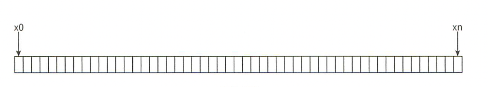

이 해시 공간을 양쪽을 구부려 접으면 해시 링이 만들어 진다

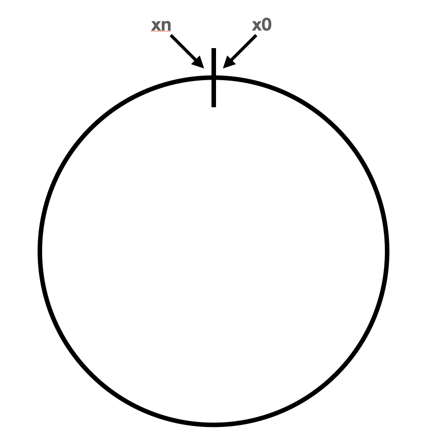

#### 해시 서버

해시 함수 f를 사용하면 서버 IP나 이름을 이 링 위의 어떤 위치에 대응시킬 수 있다

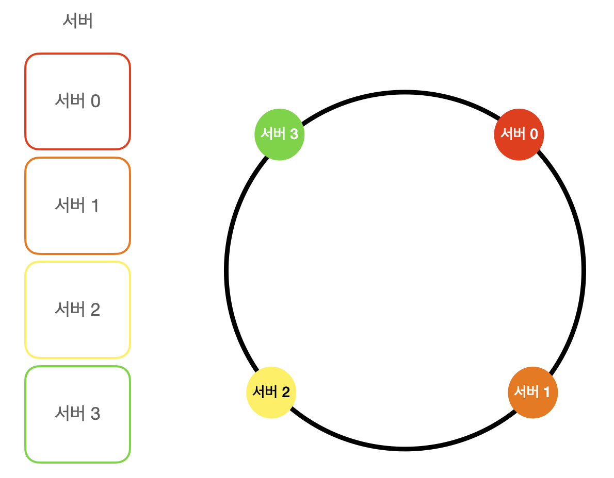

#### 해시 키

(참고로 해시 키 재배치 문제에 언급된 함수와 다르며 모듈러 연산 사용하고 있지 않다)

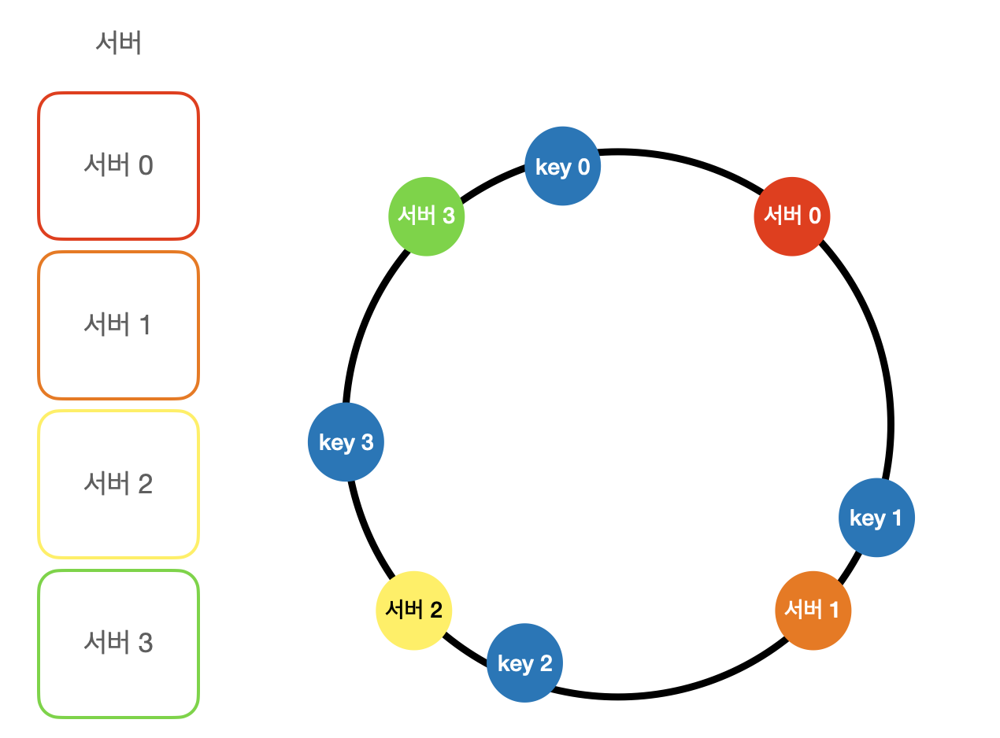

#### 서버 조회

어떤 키가 저장되는 서버는 해당 키이ㅡ 위치로부터 시계 방향으로 링을 탐색해 나가면서 만나는 첫 번째 서버다

아래 그림 참고. 따라서 key0은 서버 0에 저장되고 key1은 서버1에저장되며 .. 

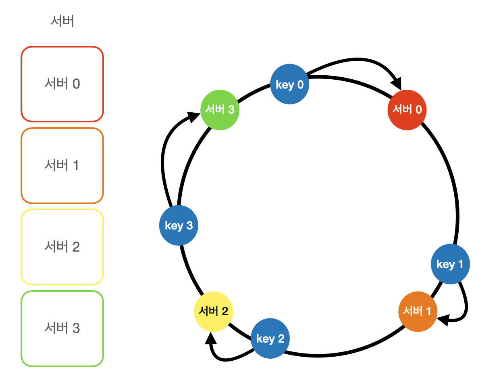

#### 서버 추가

안정 해시를 사용했으므로, 서버를 추가하더라도 키 가운데 일부만 재배치하면 된다.

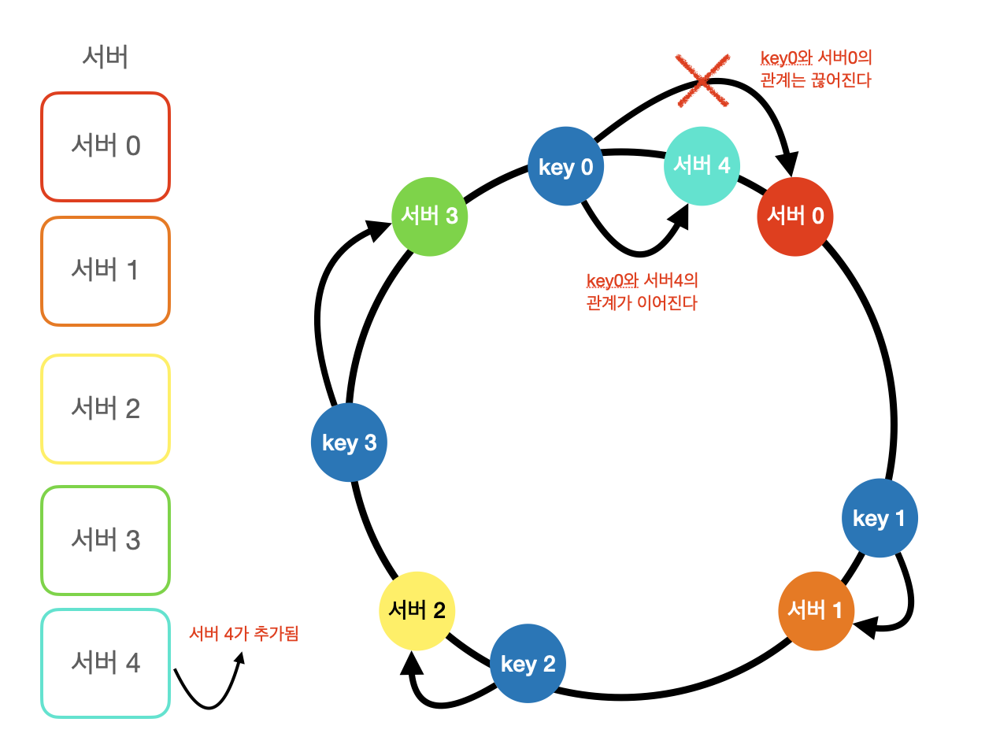

#### 서버 제거

하나의 서버가 제거되면 키 가운데 일부만 재배치된다. 서버 1이 삭제되었을 때 key1만이  서버 2로 재배치됨을 보자

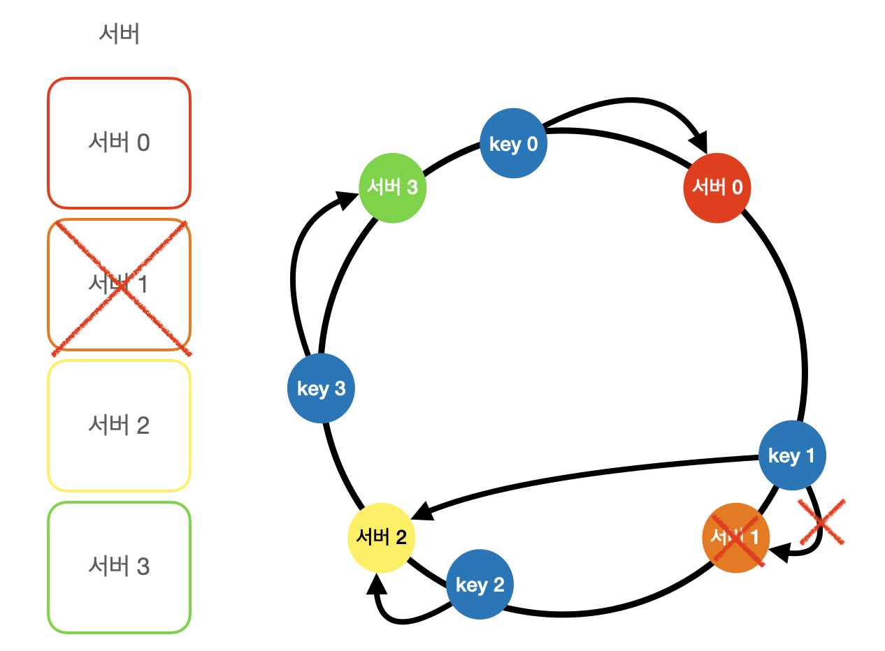

#### 기본 구현법의 두 가지 문제

- 서버와 키를 균등 분포 해시 함수를 사용해 해시 링에 배치한다
- 키의 위치에서 링을 시계방향으로 탐색하다 만나는 최초의 서버가 키가 저장될 서버다

이 접근법은 두가지 문제가 있다

1. 서버가 추가되거나 삭제되는 상황을 감안하면 파티션의 크기를 균등하게 유지하는게 
불가능

`파티션은 인접한 서버 사이의 해시 공간 의미`

즉 어떤 서버는 굉장히 작은 해시 공간을 할당받고 어떤 서버는 굉장히 큰 해시 공간을 할당받는 상황이 가능하다는 것

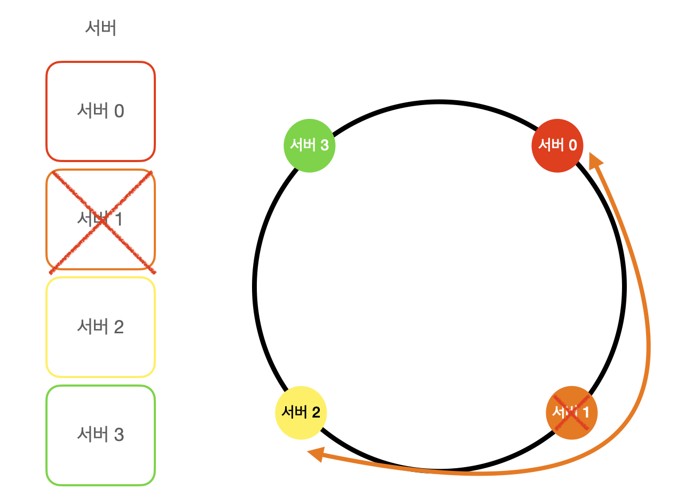

2. 키의 균등 분포를 달성하기 어렵다는 것

그림을 보면 서버 1과 서버3은 아무 데이터도 갖지 않는 반면, 대부분의 키는 서버 2에 보관될 것이다

이 문제 해결하기 위해 제안된 기법이 가상노드 또는 복제라 불리는 기법이다

#### 가상 노드

 가상 노드는 실제 노드 또는 서버를 가리키는 노드로서, 하나의 서버는 링 위에 여러 개의 가상 노드를 가질 수 있다

아래 그림은 서버 0과 서1은 3개의 가상 노드를 갖는다. 숫자 3은 임의의 수이며 실제 시스템에서는 훨씬 큰 값이 사용됨

서버 0을 링에 배치하기 위해 s0하나만 쓰는 대신, s0_0, s0_1, s0_2의 세 개 가상 노드를 사용

마찬가지로 서버 1을 링에 배치할 때는 s1_0, s1_1, s1_2의 세 개 가상 노드를 사용했다.

따라서 각 서버는 하나가 아닌 여러 개 파티션을 관리해야 한다.

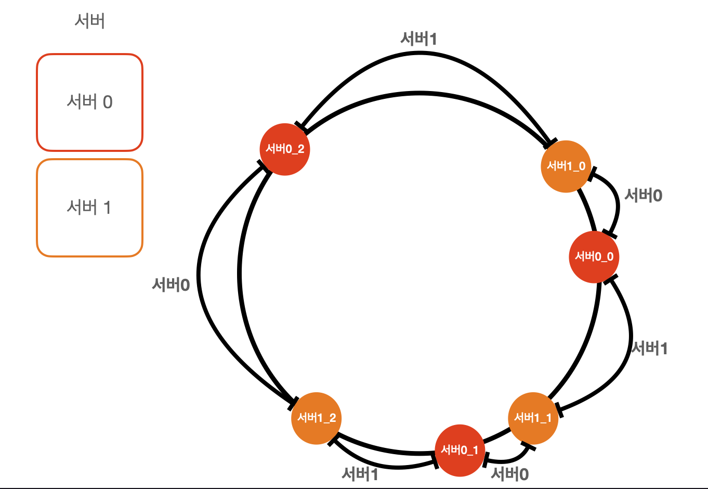

키의 위치로부터 시계방향으로 링을 탐색하다 만나는 최초의 가상 노드가 해당 키가 저장될 서버가 된다.

아래 그림은 그에 해당하는 예제고 k0가 저장되는 서버는 k0의 위치로부터 링을 시계방향으로 탐색하다

만나는 최초의 가상 노드 s1_1가 나타내는 서버, 즉 서버1이다

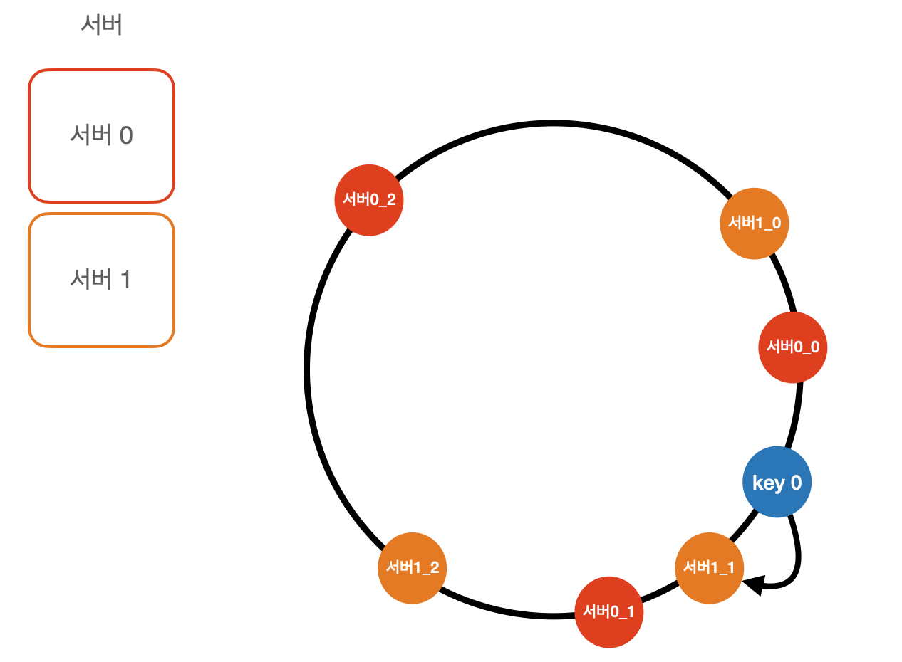

가상 노드의 개수를 늘리면 키의 분포는 점점 더 균등해지는데 표준편차가 작아져서 데이터가 고르게 분포되기 때문이다

100~200개의 가상노드를 사용할 경우 표준편차의 평균은 5%~10%사이다

가상노드의 개수를 들리면 표준편차의 값이 더 떨어진다

그러나 가상노드 데이터를 저장할 공간은 더 많이 필요하게 될 것이므로 tradeOff가 필요할 것이다

#### 재배치할 키 결정

서버가 추가되거나 제거되면 데이터 일부를 재배치해야하는데 어느 범위의 키들이 재배치 되어야 할가?

서버 4가 추가되었다고 가정하자. 영향범위는 s4부터 그 반시계 방향에 있는 첫번째 서버 s3까지다

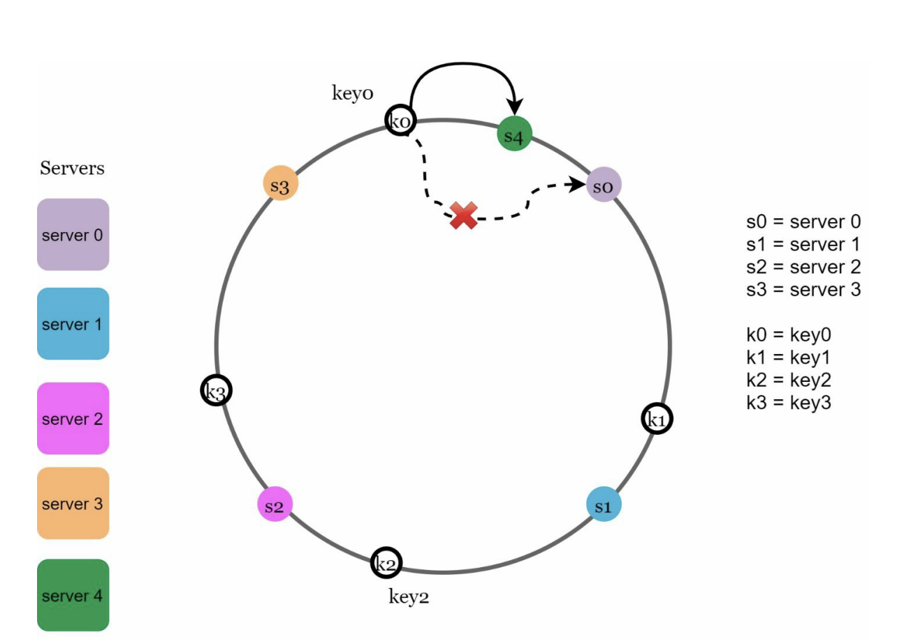

서버 s1이 아래와 같이 삭제됨녀 s1부터 그 반시계 방향에 있는 최초 서버 s0사이에 있는 키들이 s2로 재배치되어야 한다

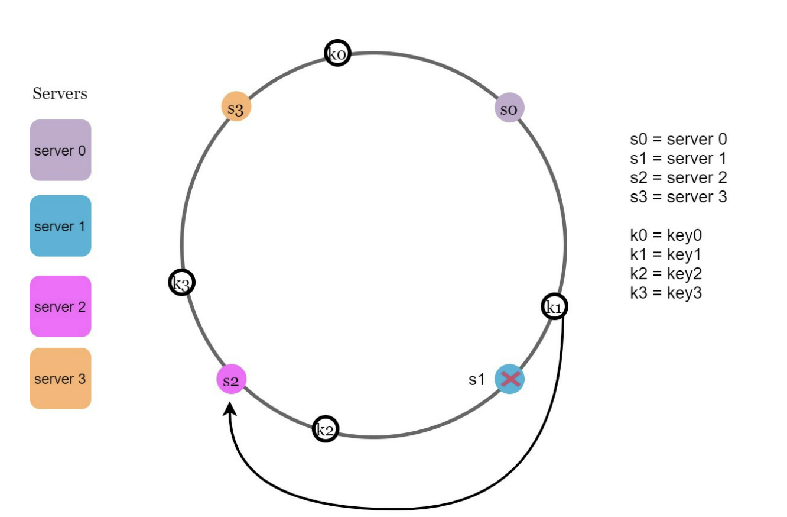

## 마치며

안정 해시의 이점은 다음과 같다

- 서버가 추가되거나 삭제될 때 재배치되는 키의 수가 최소화된다
- 데이터가 보다 균등하게 분포하게 되므로 수평적 규모 확장성을 달성하기 쉽다
- 핫스팟 키 문제를 줄인다. 특정 샤드에 대한 접근이 지나치게 빈번하면 서버 과부하 문제가 생길 수 있다

안정해시를 쓰는 기술을 보면 대표적으로 다음이 있다
- 아마존 DynamoDb의 파티셔닝 관련 컴포넌트
- 아파치 카산드라 클러스터의 데이터 파티셔닝
- 디스코드 채팅 애플리케이션
- 아카마이 CDN
- 매그레프 네트워크 부하 분산기
