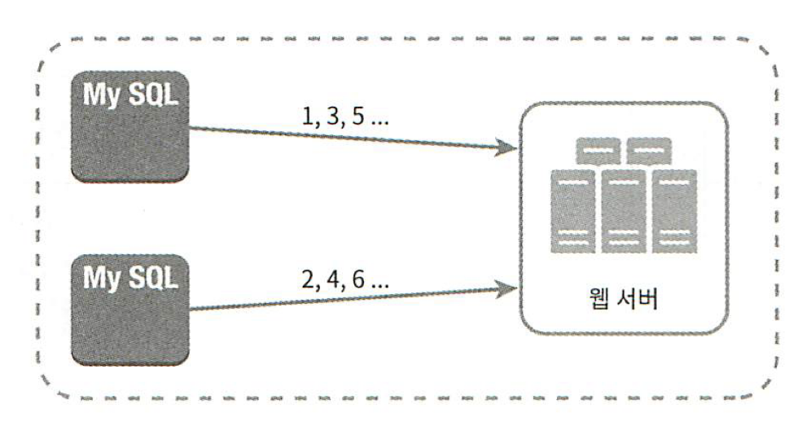

# 분산 시스템을 위한 유일 ID 생성기 설꼐

## 1단계 문제 이해 및 설계 범위 확정

- ID는 유일해야 한다
- ID는 숫자로만 구성되어야 한다
- ID는 64비트로 표현될 수 있는 값이어야 한다
- ID는 발급 날짜에 따라 정렬 가능해야 한다
- 초당 10,000개의 ID를 만들 수 있어야 한다

## 2단계 개략적 설계안 제시 및 동의 구하기

분산 시스템에서 유일성이 보장되는 ID를 만드는 방법은 여러가지고 다음과 같은 선택지를 살펴볼 것이다

- 다중 마스터 복제
- UUID
- 티켓 서버
- 트위터 스노우플레이크 접근법

`다중 마스터 복제`

이 접근법은 데이터베이스의 auto_increment 기능을 활용하는 것이고 1만큼 증가시키는게 아닌 k만큼 증가시킨다.

k는 현재 사용중인 데이터베이스의 수다.

이렇게 하면 규모 확장성 문제를 어느 정도 해결할 수 있는데, 데이터베이스 수를 늘리면 초당 생산 ID 수도 늘릴 수 있기 때문이다.

하지만 이 방법은 다음과 같은 중대한 단점이 있다

- 여러 데이터 센터에 걸쳐 규모를 늘리기 어렵다.
- ID의 유일성은 보장되겠지만 그 값이 시간 흐름에 맞추어 커지도록 보장할 수는 없다.
- 서버를 추가하거나 삭제할 때도 잘 동작하도록 만들기 어렵다.

`UUID`

UUID는 유일성이 보장되는 ID를 만드는 또 하나의 간단한 방법이다.

UUID는 컴퓨터 시스템에 저장되는 정보를 유일하게 식별하기 위한 128비트짜리 수다.

UUID 값은 충돌 가능성이 지극히 낮다

UUID는 서버 간 조율 없이 독립적으로 생성한다.

장점은 다음과 같음
- UUID를 만드는 것은 단순하다. 서버 사이의 조율이 필요 없으므로 동기화 이슈도 없다.
- 각 서버가 자기가 쓸 ID를 알아서 만드는 구조이므로 규모 확장도 쉽다.
단점은 다음과 같음 
- ID가 128비트로 길다. 이전의 ID 요구사항은 64비트이다.
- ID를 시간순으로 정렬할 수 없다.
- ID에 숫자가 아닌 값이 포함될 수 있다.

`티켓 서버`

티켓 서버는 유일성이 보장되는 ID를 만들어 내는 데 쓰일 수 있는 또 하나의 흥미로운 방법이다.

플리커는 분산 기본 키를 만들어 내기 위해 이 기술을 이용

이 아이디어의 핵심은 auto_increment 기능을 갖춘 데이터베이스 서버, 즉 티켓 서버를 중앙 집중형으로 하나만 사용

장점
- 유일성이 보장되는 숫자로만 구성된 ID를 쉽게 만들 수 있다.
- 구현하기 쉽고, 중소 규모 애플리케이션에 적합하다.
단점
- 티켓 서버가 SPOF(Single-Point-of-Failure)가 된다. 이 서버에 장애가 발생하면, 해당 서버를 이용하는 모든 시스템이 영향을 받는다. 
- 이 이슈를 피하려면 티켓 서버를 여러 대 준비해야 한다. 하지만 그렇게하면 데이터 동기화 같은 새로운 문제가 발생

`스노우 플레이크 접근법`

트위터는 스노플레이크(snowflake)라고 부르는 독창적인 ID 생성 기법을 사용한다. 이 고무적인 기법은 요구사항을 만족시킬 수 있다.

이 접근법은 분할정복을 적용했다.

생성해야 하는 ID 구조를 여러 절로 분할하는 것이다.

다음의 그림은 생성할 64비트 ID의 구조

- 사인(sign) 비트 : 1비트를 할당한다. 지금으로서는 쓰임새가 없지만 나중을 위해 유보해 둔다. 음수와 양수를 구별하는 데 사용할 수 있을 것이다.
- 타임스탬프 : 41비트를 할당한다. 기원 시각(epoch) 이후로 몇 밀리초가 경과햇는지를 나타내는 값이다. 
  
    본 설계안의 경우에는 기원 시각으로 트위터 스노플레이크 구현에서 사용하는 값 1288834974657(Nov 04, 2010, 01:42:54 UTC에 해당)을 이용할 것이다.
- 데이터센터 ID: 5비트를 할당한다. 따라서 25 = 32개 데이터센터를 지원할 수 있다.
- 서버 ID : 5비트를 할당한다. 따라서 데이터센터당 32개 서버를 사용할 수 있다.
- 일련번호 : 12비트를 할당한다. 각 서버에서는 ID를 생성할 때마다 이 일련번호를 1만큼 증가시킨다. 이 값은 1밀리초가 경과할 때마다 0으로 초기화 된다.

## 3단계 상세 설계

데이터센터 ID와 서버 ID는 시스템이 시작할 때 결정되며, 일반적으로 시스템 운영 중에는 바뀌지 않는다. 데이터센터 ID나 서버 ID를 잘못 변경하게 되면 ID 추돌이 발생할 수 있으므로, 그런 작업을 해야 할 때는 신중해야 한다.

타임스탬프나 일련번호는 ID 생성기가 돌고 있는 중에 만들어지는 값

`타임 스탬프`

임스탬프는 앞서 살펴본 ID 구조에서 가장 중요한 41비트를 차지하고 있다.

타임스탬프는 시간이 흐름에 따라 점점 큰 값을 갖게 되므로, 결국 ID는 시간 순으로 정렬 가능하게 될 것이다.

다음의 그림은 앞서 살펴본 ID 구조를 따르는 값의 이진 표현 형태로부터 UTC 시각을 추출하는 예제다.

이 방법을 역으로 적용하면 어떤 UTC 시각도 상술한 타임스탬프 값으로 변환할 수 있다

41비트로 표현할 수 있는 타임스탬프의 최대값은 2^41 - 1 = 2199023255551 밀리초다.

이 값은 대략 69년에 해당한다.

2199023255551 밀리초 / 1000 / 365일 / 24시간 / 3600초 = 69년

따라서 이 ID 생성기는 69년동안만 정상 동작하는데, 기원시각을 현재에 가깝게 맞춰서 오버플로가 발생하는 시점을 늦춰 놓은 것이다.

69년이 지나면 기원 시각을 바꾸거나 ID 체계를 다른 것으로 이전해야 한다

`일련 번호`

일련번호는 12비트이므로 2^12 = 4096개의 값을 가질 수 있다. 어떤 서버가 같은 밀리초 동안 하나 이상의 ID를 만들어 낸 경우에만 0보다 큰 값

## 4단계 마무리

스노우플레이크 방식은 모든 요구사항 만족하면서도 분산환경에서 규모 확장이 가능하다

시간이 남았다면 면접관과 다음을 추가로 논의할 수도 있을 것이다

- 시계 동기화(clock synchronization) : 각각의 서버는 시간을 동기화를 해야 한다. 일반적으로 NTP(network time protocol)를 사용한다.

- 각 부분의 길이 최적화 : 필요에 따라 각 부분의 비트를 조절할 수 있다. 69년보다 더 긴 수명이 필요하다면 타임스탬프의 비트수를 늘릴 수 있을 것이다.

- 고가용성: ID 생성기는 필수 불가결 컴포넌트이므로 높은 가용성을 제공해야 한다.