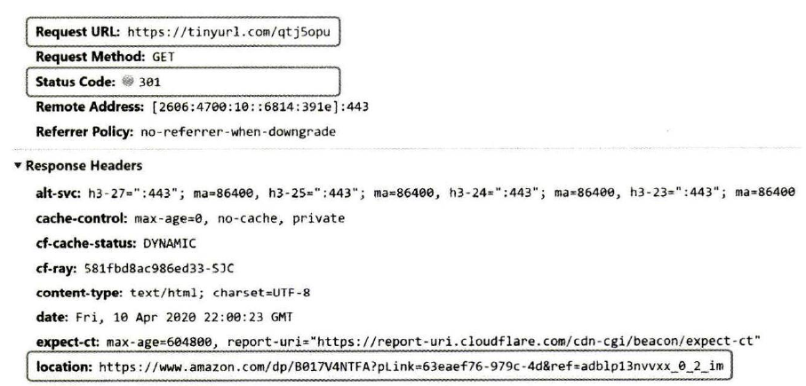
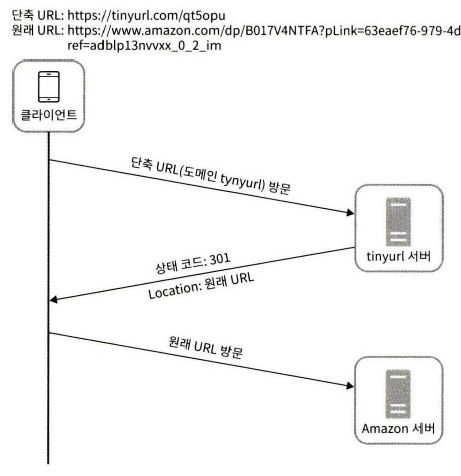
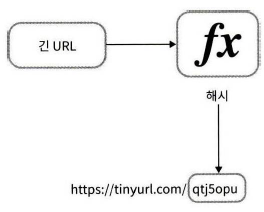
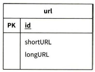
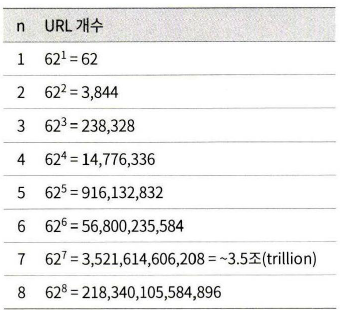
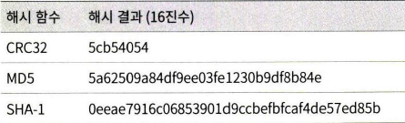
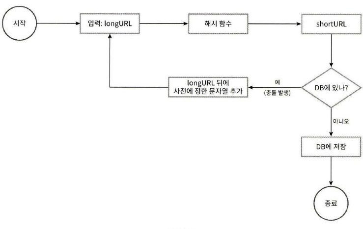
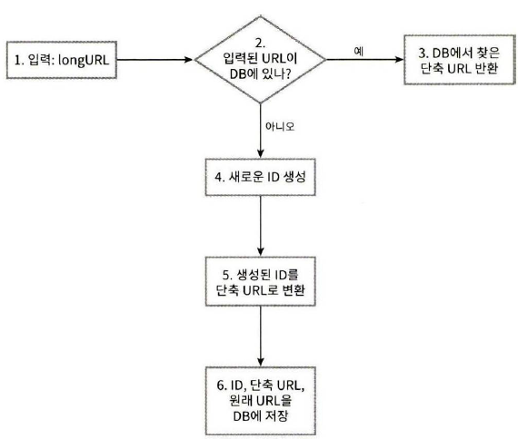
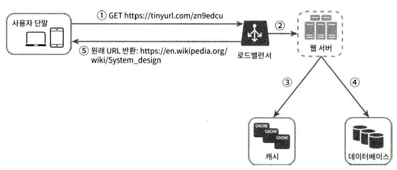

# URL 단축기 설계

## 1단계 문제 이해 및 설계 범위 확정

1. URL 단축: 주어진 긴 URL을 훨씬 짧게 줄인다
2. URL 리다이렉션: 축약된 URL로 HTTP요청이 오면 원래 URL로 안내
3. 높은 가용성과 규모 확장성, 그리고 장애 감내가 요구됨

`개략적 추정`
- 쓰기 연산 : 매일 1억 개의 URL 생성
- 초당 쓰기 연산 1억(100million) / 24 / 3600 = 1160
- 읽기 연산 : 읽기 연산과 쓰기 연산 비율은 10:1 이라고 하자. 그 경우 읽기 연산은 초당 11,600회 발생한다. (1160 x 10 = 11,600)
- URL 단축 서비스를 10년간 운영한다고 가정하면 1억 x 365 x 10 = 3650억 개의 레코드를 보관해야 한다.
축약 전 URL의 평균 길이는 100이라고 하자.
- 따라서 10년 동안 필요한 저장 용량은 3650억 x 100바이트 = 36.5TB이다.

## 2단계 개략적 설계안 제시 및 동의 구하기

`API 엔드포인트`

URL 단축기는 기본적으로 두 개의 엔드포인트를 필요로 한다.

1. URL 단축용 엔드포인트 : 새 단축 URL을 생성하고자 하는 클라이언트는 이 엔드포인트에 단축할 URL을 인자로 실어서 POST 요청을 보내야 한다. 이 엔드포인트는 다음과 같은 형태를 띤다.

    
        
        POST /api/v1/data/shorten
        인자 : {longUrl: longURLstring}
        반환: 단축 URL

2. URL 리디렉션용 엔드포인트 : 단축 URL에 대해서 HTTP 요청이 오면 원래 URL로 보내주기 위한 용도의 엔드포인트로, 다음과 같은 형태를 띤다

        GET /api/v1/shortUrl
        반환 : HTTP 리다이렉션 목적지가 될 원래 URL 

`URL 리다이렉션`

단축 URL을 받은 서버는 그 URL을 원래 URL로 바꾸어서 301 응답의 Location 헤더에 넣어 반환

301과 302응답의 차이를 유의

`301 Permenently Moved`
- 이 응답은 해당 URL에 대한 HTTP의 요청의 처리 책임이 영구적으로 Location 헤더에 반환된 URL로 이전되었다는 응답이다. 

    영구적으로 이전되었으므로, 브라우저는 이 응답을 캐시한다. 따라서 추후 같은 단축 URL에 요청을 보낼 필요가 있을 때 브라우저는 캐시된 원래 URL로 요청을 보내게 된다.
`302 Found`
- 이 응답은 주어진 URL로의 요청이 일시적으로 Location 헤더가 지정하는 URL에 의해 처리되어야 한다는 응답이다. 

    따라서 클라이언트의 요청은 언제나 단축 URL 서버에 먼저 보내진 후에 원래 URL로 리다이렉션 되어야 한다.

서버 부하를 줄이는 것이 중요하다면 301 Permanent Moved를 사용하는 것이 좋은데 첫 번째 요청만 단축 URL 서버로 전송될 것이기 때문이다. 

하지만 트래픽 분석이 중요할 때는 302 Foudn를 쓰는 쪽이 클릭 발생률이나 발생 위치를 추적하는 데 좀 더 유리할 것이다.

URL 리다이렉션을 구현하는 가장 직관적인 방법은 해시 테이블을 사용하는 것이다. 

해시 테이블에 <단축 URL, 원래 URL>의 쌍을 저장한다면, URL 리다이렉션은 다음과 같이 구현

- 원래 URL = hashTable.get(단축 URL)
- 301 또는 302 응답 Location 헤더에 원래 URL을 넣은 후 전송

`URL 단축`

단축 URL이 www.tinyurl/{hashValue} 같은 형태라고 해 보자. 결국 중요한 것은 긴 URL을 이 해시 값으로 대응시킬 해시 함수 fx를 찾는 일

이 해시 함수는 다음 요구사항을 만족해야 한다.

- 입력으로 주어지는 긴 URL이 다른 값이면 해시 값도 달라야 한다.
- 계산된 해시 값은 원래 입력으로 주어졌던 긴 URL로 복원될 수 있어야 한다.

## 3단계 상세 설계

`데이터 모델`

다음 그림은 이 테이블의 간단한 설계이다. 이 테이블은 단순화된 것으로(실제 테이블은 이것보다 더 많은 칼럼을 가질 수 있다.), id, shortURL, longURL의 세 개 칼럼을 갖는다

`해시함수`

해시 함수는 원래 URL을 단축 URL로 변환하는 데 쓰인다. 편의상 해시 함수가 계산하는 단축 URL 값을 hashValue라고 지칭

`해시 값 길이`

hashValue는 [0-9, a-z, A-Z]의 문자들로 구성된다. 따라서 사용할 수 있는 문자의 개수는 10+26+26 = 62개다. 

hashValue의 길이를 정하기 위해서는 62^n >= 3650억인 n의 최솟값을 찾아야 한다. 

개략적으로 계산했던 추정치에 따르면 이 시스템은 3650억 개의 URL을 만들어 낼 수 있어야 함

## 해시 함수 구현에 쓰이는 기술

### 1. 해시 후 충돌 해소

긴 URL을 줄이려면, 원래 URL을 7글자 문자열로 줄이는 해시 함수가 필요하다. 손쉬운 방법은 CRC32, MD5, SHA-1 같이 잘 알려진 해시 함수를 이용하는 것이다. 

이들 함수를 사용하여 'https:/en.wikipedia.org/wiki/Systems_design'을 축약한 결과는 다음과 같다.

그러나, CRC32가 계산한 가장 짧은 해시값조차도 7보다는 길다

문제를 해결할 첫 번째 방법은 계산된 해시 값에서 처음 7개 글자만 이용하는 것이다. 하지만 이렇게 하면 해시 결과가 서로 충돌할 확률이 높아진다. 

충돌이 실제로 발생했을 때는, 충돌이 해소될 때까지 사전에 정한 문자열을 해시값에 덧붙인다

충돌은 해소할 수 있지만 단축 URL을 생성할 때 한 번 이상 데이터베이스 질의를 해야 하므로 오버헤드가 크다

이터베이스 대신 블룸 필터를 사용하면 성능을 높일 수 있다. 

블룸 필터는 어떤 집합에 특정 원소가 있는지 검사할 수 있도록 하는, 확률론에 기초한 공간 효율이 좋은 기술

### 2. base-62 변환

62진법을 쓰는 이유는 hashValue에 사용할 수 있는 문자의 개수가 62개이기 때문

`URL 단축기 상세 설계`

1. 입력으로 긴 URL을 받는다.
2. 데이터베이스에 해당 URL이 있는지 검사한다.
3. 데이터베이스에 있다면 해당 URL에 대한 단축 URL을 만든 적이 있는 것이다. 따라서 데이터베이스에서 
   
    해당 단축 URL을 가져와서 클라이언트에게 반환한다.
4. 데이터베이스에 없는 경우에는 해당 URL은 새로 접수된 것이므로 유일한 ID를 생성한다. 이 ID는 데이터베이스의 기본 키로 사용된다.
5. 62진법 변환을 적용하여 ID를 단축 URL로 만든다.
6. ID, 단축 UR, 원래 URL로 새 데이터베이스 레코드를 만든 후 단축 URL을 클라이언트에게 전달한다.

`URL 리다이렉션 상세 설계`

로드밸런서의 동작 흐름은 다음과 같이 요약할 수 있다.

1. 사용자가 단축 URL을 클릭한다.
2. 로드밸런서가 해당 클릭으로 발생한 요청을 웹 서버에 전달한다.
3. 단축 URL이 이미 캐시에 있는 경우에는 원래 URL을 바로 꺼내서 클라이언트에게 전달한다.
4. 캐시에 해당 단축 URL이 없는 경우에는 데이터베이스에서 꺼낸다. 데이터베이스에 없다면 아마 사용자가 잘못된 단축 URL을 입력한 경우일 것이다.
5. 데이터베이스에서 꺼낸 URL을 캐시에 넣은 후 사용자에게 반환한다.

## 4단계 마무리

URL 단축기를 설계하면서 추가적으로 고민해 볼 수 있는 사항들이다.

- 처리율 제한 장치(rate limiter)
  - 지금까지 살펴본 시스템은 엄청난 양의 URL 단축 요청이 있을 경우 무력화될 수 있다는 잠재적 보안 결함을 갖고 있다. 
 
    처리율 제한 장치를 두면, IP 주소를 비롯한 필터링 규칙들을 이용해 요청을 걸러낼 수 있을 것이다.
- 웹 서버의 규모 확장
  - 본 설계에 포함된 웹 계층은 무상태 계층이므로, 웹 서버를 자유롭게 증설하거나 삭제할 수 있다.

- 데이터베이스의 규모 확장
  - 데이터베이스를 다중화하거나 샤딩(sharding)하여 규모 확장성을 달성할 수 있다.

- 데이터 분석 솔루션(analytics)
  - 성공적인 비즈니스를 위해서는 데이터가 중요하다. URL 단축기에 데이터 분석 솔루션을 통합해 두면 어떤 링크를 얼마나 많은 사용자가 클릭했는지, 
    
    언제 주로 클릭했는지 등 중요한 정보를 알아낼 수 있을 것이다.

- 가용성, 데이터 일관성, 안정성
  - 대규모 시스템이 성공적으로 운영되기 위해서는 반드시 갖추어야 할 속성들이다.

