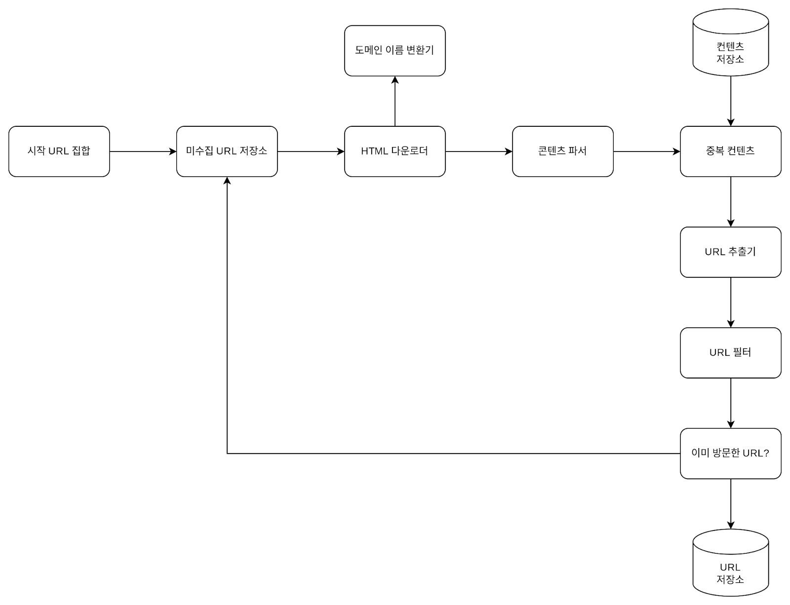

# 웹 크롤러 설계

## 1단계 문제 이해 및 설계 범위 확정

1. URL 집합이 입력으로 주어지면, 해당 URL들이 가리키는 모든 웹 페이지를 다운로드한다
2. 다운받은 웹 페이지에서 URL들을 추출한다.
3. 추출된 URL들을 다운로드할 URL 목록에 추가하고 위의 과정을 처음부터 반복한다.

#### 개략적 규모 추정

- 매달 10억 개의 웹 페이지를 다운로드한다.
- QPS = 10djr(1billion, 즉 1,000,000,000)/30일/24시간/3600초 = 약 400 페이지/초
- 최대(Peak) QPS = 2 X QPS = 800
- 웹 페이지의 크기 평균은 500k 라고 가정
- 10억 페이지 x 500k = 500TB/월
- 5년치 데이터 = 500TB x 12 개월 x 5 년 = 30PB

## 2단계 개략적 설계안 제시 및 동의 구하기

#### 시작 URL 집합
시작 URL 집합은 웹 크롤러가 크롤링을 시작하는 출발점이다.

#### 미수집 URL 저장소
대부분의 현대적 웹 크롤러는 크롤링 상태를 [다운로드할 URL, 다운로드된 URL] 의 두 가지로 나눠 관리한다. 이 중 [다운로드할 URL]을 저장 관리하는 컴포넌트를 미수집 URL 저장소라고 부른다. FIFO 큐 라고 생각하면 된다.

#### HTML 다운로더
인터넷에서 웹 페이지를 다운로드하는 컴포넌트다.

#### 도메인 이름 변환기
웹 페이지를 다운받으려면 URL을 IP 주소로 변환하는 절차가 필요하다.

#### 콘텐츠 파서
웹 페이지를 다운로드하면 파싱(parsing)과 검증(validation) 절차를 거쳐야 한다. 이상한 웹 페이지는 문제를 일으킬 수 있는데다 저장 공간만 낭비하게 된다

#### 중복 컨텐츠??

웹에 공개된 연구 결과에 따르면, 29% 가량의 웹 페이지 콘텐츠는 중복이다.

따라서 중복을 줄이면 데이터 처리에 소요되는 시간도 줄일 수 있다.

두 HTML 문서를 비교하는 가장 간단한 방법은 웹 페이지의 해시 값을 비교하는 것

#### 콘텐츠 저장소
콘텐츠 저장소는 HTML 문서를 보관하는 시스템이다.

저장소를 구현할 때는 저장할 데이터의 유형, 크기, 접근 빈도, 데이터의 유효 기간 등을 종합적으로 고려해야 한다.

- 데이터 양이 너무 많으므로 대부분의 컨텐츠는 디스크에 저장
- 인기 있는 컨텐츠는 메모리에 두어 접근 지연시간을 줄임

#### URL 추출기
URL 추출기는 HTML 페이지를 파싱하여 링크들을 골라내는 역할을 한다.
상대 경로는 전부 절대 경로로 변환한다.

#### URL 필터

- 특정 컨텐츠 타입
- 특정 파일 확장자
- 접속시 오류가 발생하는 URL
- 접근 제외 목록 에 포함된 URL

들을 대상에서 배제하는 역할

#### 이미 방문한 URL??
이미 방문한 URL이나 미수집 URL 저장소에 보관된 URL을 추적할 수있는 자료구조를 사용한다.

블룸 필터나 해시 테이블이 널리 쓰인다

#### URL 저장소
URL 저장소는 이미 방문한 URL을 보관하는 저장소이다.

#### 웹 크롤러 작업 흐름

1. 시작 URL들을 미수집 URL 저장소에 저장한다.

2. HTML 다운로더는 미수집 URL 저장소에서 URL 목록을 가져온다.

3. HTML 다운로더는 도메인 이름 변환기를 사용하여 URL의 IP 주소를 알아내고, 해당 IP 주소로 접속하여 웹 페이지를 다운받는다.

4. 콘텐츠 파서는 다운된 HTML 페이지를 파싱하여 올바른 형식을 갖춘 페이지인지 검증한다.

5. 콘텐츠 파싱과 검증이 끝나면 중복 콘텐츠인지 확인하는 절차를 개시한다.

6. 중복 콘텐츠인지 확인하기 위해서, 해당 페이지가 이미 저장소에 있는지 본다. 이미 저장소에 있는 콘텐츠인 경우에는 처리하지 않고 버린다. 
   
   저장소에 없는 콘텐츠인 경우에는 저장소에 저장한 뒤 URL 추출기로 전달한다.

7. URL 추출기는 해당 HTML 페이지에서 링크를 골라낸다.

8.  골라낸 링크를 URL 필터로 전달한다.

9.  필터링이 끝나고 남은 URL만 중복 URL 판별 단계로 전달한다.

10. 이미 처리한 URL인지 확인하기 위하여, URL 저장소에 보관된 URL인지 살핀다. 이미 저장소에 있는 URL은 버린다.

11. 저장소에 없는 URL은 URL 저장소에 저장할 뿐 아니라 미수집 URL 저장소에도 전달한다.

## 3단계 상세 설계

`DFS를 쓸 것인가, BFS를 쓸 것인가`

웹은 유향 그래프(directed graph)와 같다. 페이지는 노드고 하이퍼 링크는 엣지(edge)라고 보면 된다.

크롤링 프로세스는 이 유향 그래프를 엣지를 따라 탐색하는 과정이다.

DFS(depth-first search, 깊이 우선 탐색), BFS(breadth-first search, 너비 우선 탐색)는 바로 이 그래프 탐색에 널리 사용되는 두 가지 알고리즘이다.

하지만 웹 크롤링 에서는 DFS는 좋은 선택이 아닐 가능성이 높다. 그래프 크기가 클 경우 

어느 정도로 깊숙히 가게 될지 가늠하기 어려워서다. 따라서 웹 크롤러는 보통 BFS를 사용한다

### `미수집 URL 저장소`

#### 예의

수집 대상 서버로 짧은 시간 안에 너무 많은 요청을 보내는 것을 삼가야 한다. 

너무 많은 요청을 보내는 것은 ‘무례한(impolite)’일이며, 때로는 DoS(Denial-of-Service) 공격으로 간주되기도 한다.

예의 바른 크롤러를 만드는 데 있어서 지켜야 할 한 가지 원칙은, 동일 웹 사이트에 대해서는 한 번에 한 페이지만 요청한다는 것이다.

이 요구 사항을 만족시키려면 호스트명과 다운로드를 수행하는 작업 스레드 사이의 관계를 유지하면 된다.

- 큐 라우터 : 같은 호스트에 속한 URL은 언제나 같은 큐(b1, b2, … , bn)로 가도록 보장하는 역할을 한다.
- 매핑 테이블 : 호스트 이름과 큐 사이의 관계를 보관하는 테이블
- FIFO 큐 (b1, b2, … , bn) : 같은 호스트에 속한 URL은 언제나 같은 큐에 보관된다.

- 큐 선택기: 큐 선택기는 큐들을 순회하면서 큐에서 URL을 꺼내서 해당 큐에서 나온 URL을 다운로드하도록 지정된 작업 스레드에 전달하는 역할을 한다.
- 작업 스레드: 작업 스레드는 전달된 URL을 다운로드 하는 작업을 수행한다. 전달된 URL은 순차적으로 처리될 것이며, 작업들 사이에는 일정한 지연시간(delay)을 둘 수 있다

#### 우선순위

- 순위결정장치(prioritizer) : URL을 입력으로 받아 우선순위를 계산한다.

- 큐(f1, … fn): 우선순위별로 큐가 하나씩 할당된다.

- 큐 선택기: 임의 큐에서 처리할 URL을 꺼내는 역할을 담당한다. 순위가 높은 큐에서 더 자주 꺼내도록 구성한다.

이를 반영한 전체 설계는 두 개 모듈이 존재한다

- 전면 큐 : 우선순위결정 과정을 처리한다.
- 후면 큐: 크롤러가 예의 바르게 동작하도록 보증한다.

#### 신선도

웹 페이지는 수시로 추가되고, 삭제되고, 변경된다. 따라서 데이터의 신선함(freshness)을 유지하기 위해서는 

이미 다운로드한 페이지라고 해도 주기적으로 재수집(recrawl)할 필요가 있다

#### 미수집 URL 저장소를 위한 지속성 저장 장치

대부분의 URL은 디스크에 두지만 IO 비용을 위해 메모리 버퍼에 큐를 두게 처리한다. 버퍼에 있는 데이터는 주기적으로 디스크에 기록

### HTML 다운로더

`Robots.txt`

이 파일에는 크롤러가 수집해도 되는 페이지 목록 규칙이 들어가 있다. 따라서 크롤러는 해당 파일에 나열된 규칙을 먼저 확인

`성능 최적화`

1. 분산 크롤링
- 성능을 높이기 위해 크롤링 작업을 여러 서버에 분산한다. 각 서버는 여러 스레드를 돌려 다운로드 작업을 처리한다.

2. 도메인 이름 변환 캐시
- 도메인 이름 변환기(DNS Resolver)는 크롤러 성능의 병목 중 하나이다. DNS 변환 작업은 동기적 특성을 지니기 때문에 
  
   DNS 요청의 결과를 받기 전까지는 모든 스레드의 DNS 요청은 전부 블락된다.

   따라서 DNS 조회 결과로 얻어진 도메인 이름과 IP 주소 사이의 관계를 캐시에 보관해두고 주기적으로 갱신
3. 지역성
- 서버를 지역별로 분산한다. 크롤링 서버가 대상 서버와 지역적으로 가까우면 페이지 다운로드 시간은 줄어들 것이다.

4. 짧은 타임 아웃
- 떤 웹 서버는 응답이 느리거나 아예 응답하지 않는다. 이런 경우 대기 시간이 길어지면 좋지 않으므로, 최대 얼마나 기다릴지를 미리 정해두기

#### 안정성

`안정 해시`

다운로더 서버들에 부하를 분산할 때 적용 가능하다. 안정해시를 통해서 서버를 쉽게 추가하고 삭제할 수 있다.

`크롤링 상태 및 수집 데이터 저장`

장애가 발생한 경우에도 쉽게 복구할 수 있도록 크롤링 상태와 수집된 데이터를 지속적 저장장치에 기록해두는 것이 바람직 하다.

`예외 처리`

예외가 발생해도 전체 시스템이 중단되는 일 없이 그 작업을 우아하게 이어나갈 수 있도록 해야한다.

`데이터 검증`

시스템 오류를 방지하기 위한 중요 수단 가운데 하나이다.

#### 확장성

진화하지 않는 시스템은 없다. 따라서 새로운 형태의 콘텐츠를 쉽게 지원할 수 있도록 신경 써야함

#### 문제 있는 컨텐츠 감지 및 회피

1. 중복 콘텐츠
   
웹 콘텐츠의 30% 가량은 중복이다. 해시나 체크섬을 사용하여 중복을 쉽게 탐지할 수 있다.

2. 거미 덫
거미 덫(spider trap)은 크롤러를 무한 루프에 빠뜨리도록 설계한 웹 페이지다.

이런 덮은 URL의 최대 길이를 제한하면 회피할 수 있다. 

하지만 가능한 모든 종류의 덮을 피할 수 있는 만능 해결책은 없다. 다만 이런 덫이 설치된 웹 사이트인지 알아내는 것은 어렵지 않은데, 

기이할 정도로 많은 웹 페이지를 가지고 있는 것이 일반적이라서이다.

덫이 있는 사이트를 크롤러 탐색 대상에서 제외하거나 URL 필터 목록에 추가 처리한다.

3. 데이터 노이즈
광고나 스크립트 코드, 스팸 URL 같은 것

## 4단계 마무리

- 서버측 렌더링
  - 많은 웹사이트가 자바스크립트를 사용해 링크를 즉석에서 만들어 낸다.
  - 그러니 웹 페이지를 그대로 다운받아 파싱해보면 동적으로 생성되는 링크는 발견할 수 없다
  - 이 문제는 페이지 파싱하기 전에 서버 측 렌더링을 적용하면 해결할 수 있다
- 원치 않는 페이지 필터링

  - 스팸 방지 컴포넌트를 두어 품질이 조악하거나 스팸성인 페이지를 걸러내도록 해 두면 좋다.
  - 그런데 구글 검색에도 최근 스팸 사이트가 많은 것으로 보아 스팸을 걸러내는게 쉽지만은 않은 것 같다.

- 데이터베이스 다중화 및 샤딩

- 수평적 규모 확장성

- 가용성, 일관성, 안정성

- 데이터 분석 솔루션